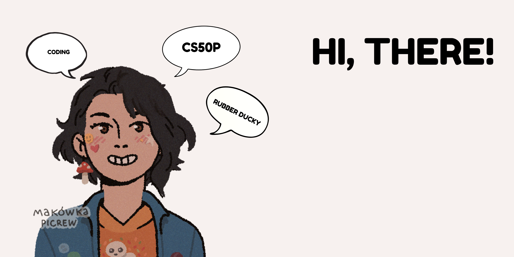
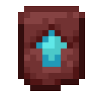

#  Hi There! I'm Selena! 

I am Selena, a curious 11-year-old who loves technology, coding, and finding ways to solve important problems with simple ideas. My dream is to have every child in the world have access to technology and the chance to innovate.  

##  About Me  
&nbsp;&nbsp;&nbsp;&nbsp; **Name:** Selena Marwaha 

&nbsp;&nbsp;&nbsp;&nbsp; **Age:** 11  

&nbsp;&nbsp;&nbsp;&nbsp; **Grade:** 5  

&nbsp;&nbsp;&nbsp;&nbsp; **Nationality:** Indian

&nbsp;&nbsp;&nbsp;&nbsp; **Location:** Dubai, UAE  

&nbsp;&nbsp;&nbsp;&nbsp; **Languages**: English (Native), French (Intermediate), Hindi (Intermediate) 

&nbsp;&nbsp;&nbsp;&nbsp; **Coursework**: Harvard CS50 Python via edX 

&nbsp;&nbsp;&nbsp;&nbsp; **Programming Languages**: Python, HTML, CSS

&nbsp;&nbsp;&nbsp;&nbsp; **Libraries**: `pygame`, `csv`, `tkinter`, `requests`, `json`, `random`, `sys`, `pillow`, `cowsay`, `inflect`

&nbsp;&nbsp;&nbsp;&nbsp; **Hobbies**: Horse-riding, drawing, collecting stickers

##  Speaking Highlights   

 **COP28 – Dubai, UAE**    

During Conference of the Parties in 2023, at age 9, I did a talk about using technology to engage the next generation of children and youth. I met a lot of interesting people, shared my passion for technology, and ate some great chicken shawarma. 

Talk: *Using Tech to Engage the Next Generation of Children and Youth*

 **COP29 – Baku, Azerbaijan**   

During Conference of the Parties in 2024, at age 10, I did a talk about education and its ability to empower and inspire my generation to action. I also participated in a panel where I spoke in front of a crowd of about 1000 people on the importance of quality education for underserved communities and areas. This connects to my work with sustainabilitybytech.

Talk: *Education as the Key Driver to Empower the Next Generation of Changemakers*  
Panel: *Headline event with YOUNGO and high-level delegates, where I spoke about the importance of quality education in underprivileged areas*

 **World Youth Skills Day – UNESCO, Paris**  

In July 2025, I attended an event held by UNESCO for World Youth Skills Day at the Learning Planet Institute in Paris. Here, I spoke about how digital tools connect us globally, create opportunities to work with mentors, and allow kids to collaborate on projects around the world.

Talk: *The Power of Digital Tools* **💻**

## Projects & Initiatives  

### Sustainability by Tech   
This initiative transforms e-waste donations and community partnerships into maker spaces for children.  

**Why it matters:** Many children from underprivileged schools receive their first computer through these hubs. This gives them a new chance for learning and innovation.

**Impact so far:**  
- The first hub was launched in Uganda, where students created a food dehydrator for tomatoes. This project was selected as a finalist in the Zayed Sustainability Prize. 

- The initiative is expanding to the Philippines, where new hubs are being built in schools so rural students have to paddle across a river to get there! 

**How it works:** We hold donation drives, collect monitors, PCs, laptops, tools, craft supplies, and more. We bring these to under-funded schools to create maker spaces and tech rooms. Older students act as mentors, younger students learn from them, and together they create meaningful projects that make a lasting impact in their communities.  

## Awards & Recognition  

- **SIWI Stockholm International Water Award**

    Age: 8

    Description: For this award, I was the youngest and only female finalist in my category. Awarded this for making a water saving toilet that cuts water waste by up to 35% per flush. 

- **Press Feature** 

    Age: 10 

    Description: Featured in international press as “A 10-year-old leading the Technological Revolution across the International Stage” 

- **Miscellaneous**

    Description: Multiple technology and innovation awards for projects combining sustainability and accessibility  